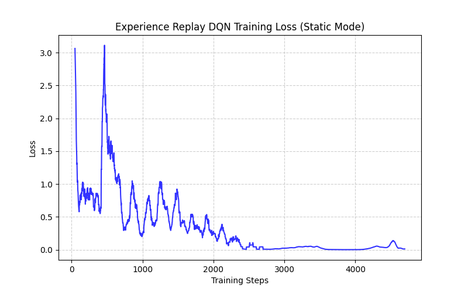

# 0513DRL_HW3: Deep Reinforcement Learning - DQN and Variants

This repository contains the implementation of Deep Q-Networks (DQN) and several of its advanced variants, applied to a Gridworld environment.

---

### ❓ Q1: HW3-1 Naive DQN for static mode
**Task:** Run the provided code naive or Experience buffer reply. Submit a short understanding report.

**💡 Understanding Report:**
In `static` mode, all objects are fixed.
- **Naive DQN:** Trains strictly online. Since consecutive frames are highly correlated, the learning process oscillates heavily and struggles to stabilize.
- **Experience Replay:** Solves instability by storing past experiences in a buffer and sampling mini-batches randomly. This breaks temporal correlation, drastically improving the smoothness and convergence of the learning curve.

**📊 Results:**
| Naive DQN Loss | Experience Replay DQN Loss |
|:---:|:---:|
|  |  |

---

### ❓ Q2: HW3-2 Enhanced DQN Variants for player mode
**Task:** Implement and compare Double DQN and Dueling DQN. Focus on how they improve upon the basic DQN approach.

**💡 Improvements Explanation:**
- **Double DQN:** Basic DQN suffers from overestimation bias because it uses the same network to select and evaluate actions. Double DQN decouples this: it uses the Main Network to select the action and the Target Network to evaluate it, yielding more accurate Q-values.
- **Dueling DQN:** Splits the network into a Value stream (how good the state is generally) and an Advantage stream (how much better an action is compared to others). This allows the network to learn which states are valuable without having to learn the effect of each action for every single state.

**📊 Results:**
| Double DQN vs Dueling DQN |
|:---:|
|  |

---

### ❓ Q3: HW3-3 Enhance DQN for random mode WITH Training Tips
**Task:** Convert the DQN model from PyTorch to either Keras or PyTorch Lightning. Bonus points for integrating training techniques to stabilize/improve learning.

**💡 Implementation & Tips:**
We converted the model to **PyTorch Lightning** (`LitDQN` class) for the hardest `random` environment. To stabilize training in this chaotic mode, we integrated:
- 📉 **Learning Rate Scheduling:** Added `StepLR` to gradually decay the learning rate, helping the model fine-tune its policy as it converges.
- ✂️ **Gradient Clipping:** Set `gradient_clip_val=1.0` in the Trainer to ensure updates remain within a stable bound and prevent exploding gradients when rewards fluctuate wildly.
- 🏋️ **AdamW Optimizer:** Introduced weight decay (L2 regularization) to prevent overfitting to specific random map configurations.
- 📦 **Large Replay Buffer:** Increased capacity to 10,000 to avoid forgetting rare configurations.

**📊 Results:**
| PyTorch Lightning Training Loss |
|:---:|
|  |

**Result Summary:**
The PyTorch Lightning model successfully encapsulated the training loop. By applying these tips, the model managed to converge effectively in the `random` environment where all objects (Player, Goal, Pit, Wall) spawn arbitrarily.

---

## 🛠 Setup & Requirements
To run the scripts locally, make sure you have the following Python packages installed:
```bash
pip install torch torchvision pytorch-lightning matplotlib numpy pandas
```

## 🏃 How to Run
```bash
# Run Basic DQN & Experience Replay
python hw3_1_dqn.py

# Run Double DQN & Dueling DQN
python hw3_2_variants.py

# Run PyTorch Lightning DQN
python hw3_3_lightning.py
```

---

## 💬 Development Log & Interaction Process
**How we arrived at these results step-by-step:**

- ❓ **Step 1: Analyzing the Assignment**
  The process began by reviewing the homework instructions for HW3-1, HW3-2, and HW3-3.

- 💻 **Step 2: Step-by-Step Implementation**
  We systematically built the models in three separate Python scripts:
  - **HW3-1:** `hw3_1_dqn.py` (Basic DQN with Experience Replay in static mode)
  - **HW3-2:** `hw3_2_variants.py` (Double DQN vs Dueling DQN in player mode)
  - **HW3-3:** `hw3_3_lightning.py` (PyTorch Lightning with LR Scheduler, Gradient Clipping in random mode)

- 📊 **Step 3: Generating Results & Documentation**
  Finally, we wrote automated scripts to plot loss and reward curves, generated this comprehensive `README.md`, and constructed a dynamic webpage (`index.html`) to visually present the project.
