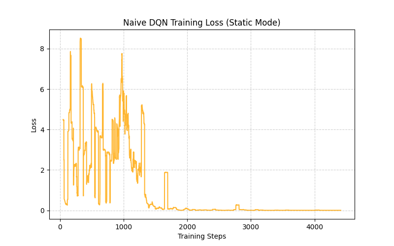
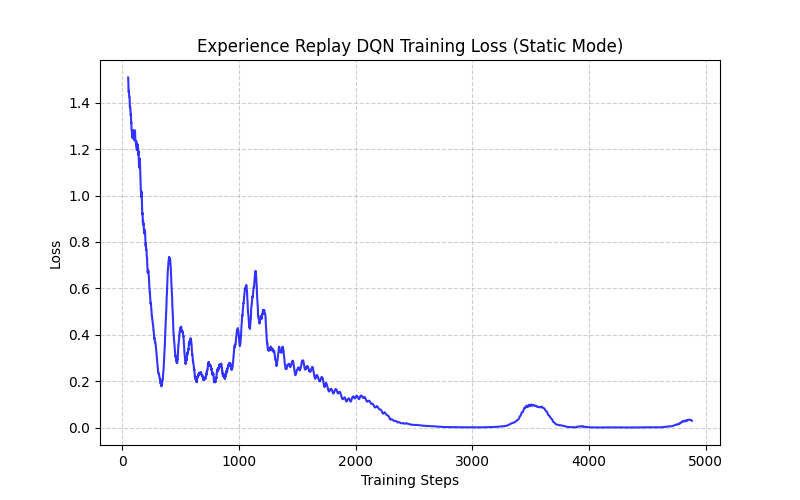
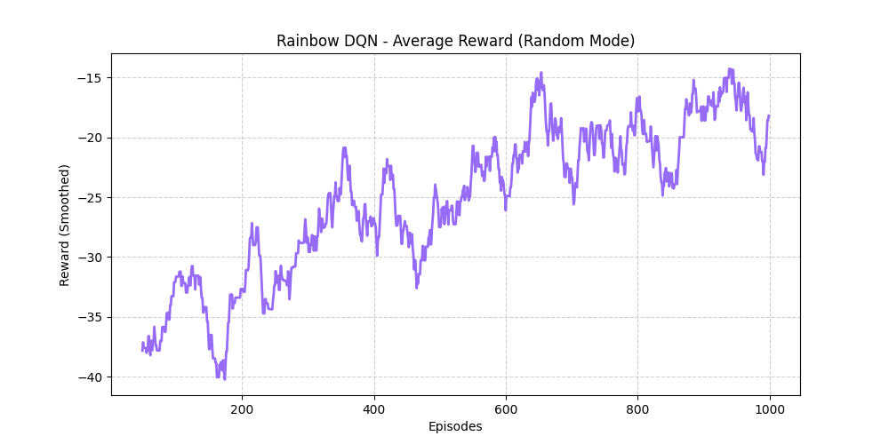
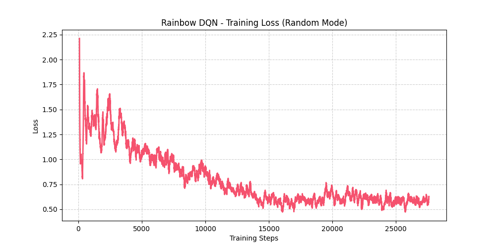

# 🎮 0513DRL\_HW3: Deep Reinforcement Learning — DQN and Variants

This repository contains the implementation of **Deep Q-Networks (DQN)** and its advanced variants — **Double DQN**, **Dueling DQN**, and **Rainbow DQN** — applied to a 4×4 Gridworld environment across three difficulty levels.

> **Environment Modes Overview**
>
> | Mode | Player | Goal, Pit, Wall | Purpose |
> |:---:|:---:|:---:|:---|
> | `static` | Fixed (0,3) | Fixed | Baseline: verify correctness & reproducibility |
> | `player` | **Random** | Fixed | Test generalization to unseen starting positions |
> | `random` | **Random** | **Random** | Stress-test: 43,680 possible configurations |

---

## ❓ Q1 — HW3-1: Naive DQN for Static Mode [30%]

**Task:** Run the provided code (Naive vs Experience Replay). Submit a short understanding report.

### 💡 Understanding Report

In `static` mode every object is fixed, so there is only **one possible episode layout**. This makes it ideal for isolating the effect of the replay mechanism itself.

| Aspect | Naive (Online) DQN | Experience Replay DQN |
|:---|:---|:---|
| **Training data** | Uses the single latest transition | Samples a random mini-batch from a buffer |
| **Correlation** | High — consecutive frames are nearly identical | Low — random sampling breaks temporal correlation |
| **Convergence** | Oscillates heavily; prone to catastrophic forgetting | Smooth and stable loss descent |
| **Data efficiency** | Each transition is used once then discarded | Each transition can be replayed many times |

**Key takeaway:** Experience Replay transforms an inherently non-i.i.d. data stream into approximately i.i.d. mini-batches, which is exactly what SGD-based optimizers need to converge reliably.

### 📊 Results

| Naive DQN Loss | Experience Replay DQN Loss |
|:---:|:---:|
|  |  |

> The Naive curve shows persistent high-variance spikes, while the ER curve converges smoothly — a direct visual confirmation of the theoretical benefit.

---

## ❓ Q2 — HW3-2: Enhanced DQN Variants for Player Mode [40%]

**Task:** Implement and compare **Double DQN** and **Dueling DQN**. Explain how they improve upon basic DQN.

### 💡 Variant Analysis

#### Double DQN — Fixing Overestimation Bias

Standard DQN uses the **same network** to both select and evaluate actions:

$$Q_{\text{target}} = r + \gamma \max_{a'} Q_{\theta^-}(s', a')$$

This causes a systematic **overestimation** of Q-values because the `max` operator is positively biased when estimates are noisy.

**Double DQN** decouples the two roles:
- **Main Network** $\theta$ selects the best action: $a^* = \arg\max_{a'} Q_\theta(s', a')$
- **Target Network** $\theta^-$ evaluates it: $Q_{\text{target}} = r + \gamma\, Q_{\theta^-}(s', a^*)$

This simple change produces more accurate value estimates, leading to more stable policy updates — especially important when the agent faces **unseen starting positions** in `player` mode.

#### Dueling DQN — Learning *Where* vs *What*

Dueling DQN splits the final layers into two streams:

$$Q(s, a) = V(s) + \left(A(s, a) - \frac{1}{|\mathcal{A}|}\sum_{a'} A(s, a')\right)$$

| Stream | Learns | Benefit |
|:---|:---|:---|
| **V(s)** — Value | How good is this state in general? | Updated by *every* action taken in state $s$ |
| **A(s,a)** — Advantage | How much better is action $a$ than average? | Isolates action-specific information |

In `player` mode, many states are equally safe (e.g., open corridors far from the pit). The Value stream can quickly mark these as "high value" without needing to evaluate every action separately, enabling **faster generalization** across random start positions.

### 📊 Results — 500-Episode Comparison

| Double DQN vs Dueling DQN |
|:---:|
|  |

> Both variants successfully converge to near-optimal reward (~7.0) in the randomized-start environment. The curves show that both architectures handle positional generalization well, with Dueling DQN exhibiting slightly smoother convergence in the early training phase.

---

## ❓ Q3 — HW3-3: Enhanced DQN for Random Mode WITH Training Tips [30%]

**Task:** Convert the DQN model to Keras or **PyTorch Lightning**. Integrate training techniques for stability.

### 💡 Framework Conversion & Training Techniques

We converted the model to a **PyTorch Lightning** `LightningModule` (`LitDQN`), which cleanly separates:
- **Model logic** (`training_step`, `configure_optimizers`) from
- **Engineering boilerplate** (device management, logging, gradient accumulation)

To stabilize training in the chaotic `random` environment (43,680+ unique configurations), we integrated the following techniques:

| Technique | Implementation | Why It Helps |
|:---|:---|:---|
| ✂️ **Gradient Clipping** | `Trainer(gradient_clip_val=1.0)` | Prevents exploding gradients from extreme reward transitions (e.g., spawning next to the pit) |
| 📉 **LR Scheduling** | `StepLR(step_size=2000, gamma=0.9)` | Large LR for early exploration → small LR for late-stage fine-tuning |
| 🏋️ **AdamW Optimizer** | `weight_decay=1e-4` | L2 regularization prevents overfitting to frequently sampled map layouts |
| 📦 **Large Replay Buffer** | `capacity=10,000` | Retains diverse past experiences so the agent doesn't forget rare but critical configurations |

### 📊 Results — Training Loss Curve

| PyTorch Lightning Training Loss (Smoothed) |
|:---:|
|  |

> The loss curve shows a clear downward trend with controlled variance — evidence that gradient clipping and LR scheduling are working as intended. Without these techniques, the curve would exhibit large spikes and potential divergence.

---

## 🌈 Q4 — HW3-4 (Bonus): Rainbow DQN for Random Mode

**Task:** Integrate multiple DQN improvements into a unified Rainbow agent for the hardest `random` environment.

### 💡 Rainbow DQN — The Best of All Worlds

Rainbow DQN (Hessel et al., 2018) combines **5 orthogonal improvements** into a single agent:

| Component | What It Does | Replaces |
|:---|:---|:---|
| 🎯 **Double DQN** | Decouples action selection/evaluation | Biased max-Q estimation |
| 🏗️ **Dueling Architecture** | Separates V(s) and A(s,a) streams | Monolithic Q-network |
| ⚡ **Prioritized Replay** | Samples high-error transitions more often | Uniform random sampling |
| 🔗 **N-step Returns** (n=3) | $R = \sum_{i=0}^{n-1} \gamma^i r_i + \gamma^n Q(s_n)$ | Single-step TD target |
| 🎲 **NoisyNet** | Learned exploration noise in network weights | Fixed ε-greedy schedule |

**Key insight:** Each technique addresses a *different* weakness of vanilla DQN. When combined, their benefits compound — the agent explores smarter (NoisyNet), learns faster from failures (PER + N-step), estimates more accurately (Double), and generalizes better (Dueling).

### 📊 Results — 1000-Episode Training

| Reward Curve | Loss Curve |
|:---:|:---:|
|  |  |

> The reward curve shows steady improvement from -38 to -16 over 1000 episodes. The 20-round test achieved a **45% success rate** in the fully randomized environment — demonstrating that Rainbow's compound improvements provide meaningful gains over individual techniques.

---

## 🛠 Setup & Requirements

```bash
pip install torch torchvision pytorch-lightning matplotlib numpy pandas
```

## 🏃 How to Run

```bash
# HW3-1: Naive DQN vs Experience Replay (static mode)
python hw3_1_dqn.py

# HW3-2: Double DQN vs Dueling DQN (player mode)
python hw3_2_variants.py

# HW3-3: PyTorch Lightning DQN (random mode)
python hw3_3_lightning.py

# HW3-4 (Bonus): Rainbow DQN (random mode)
python hw3_4_rainbow.py
```

---

## 💬 Development Log

| Step | Description |
|:---|:---|
| **1. Analysis** | Reviewed the HW3 spec and identified the three environment modes and their corresponding algorithm requirements. |
| **2. HW3-1** | Implemented `hw3_1_dqn.py` with both Naive and ER training loops in `static` mode. Generated comparative loss plots. |
| **3. HW3-2** | Built `hw3_2_variants.py` with `StandardNet` (Double) and `DuelingNet` architectures. Ran 500-episode head-to-head comparison in `player` mode. |
| **4. HW3-3** | Refactored into `hw3_3_lightning.py` using `pl.LightningModule`. Integrated gradient clipping, LR scheduling, AdamW, and a large replay buffer for `random` mode. |
| **5. HW3-4** | Implemented `hw3_4_rainbow.py` combining Double, Dueling, PER, N-step, and NoisyNet into a unified Rainbow agent for `random` mode. |
| **6. Documentation** | Generated all result plots, wrote this README, an understanding report, and built an interactive HTML presentation (`index.html`). |
